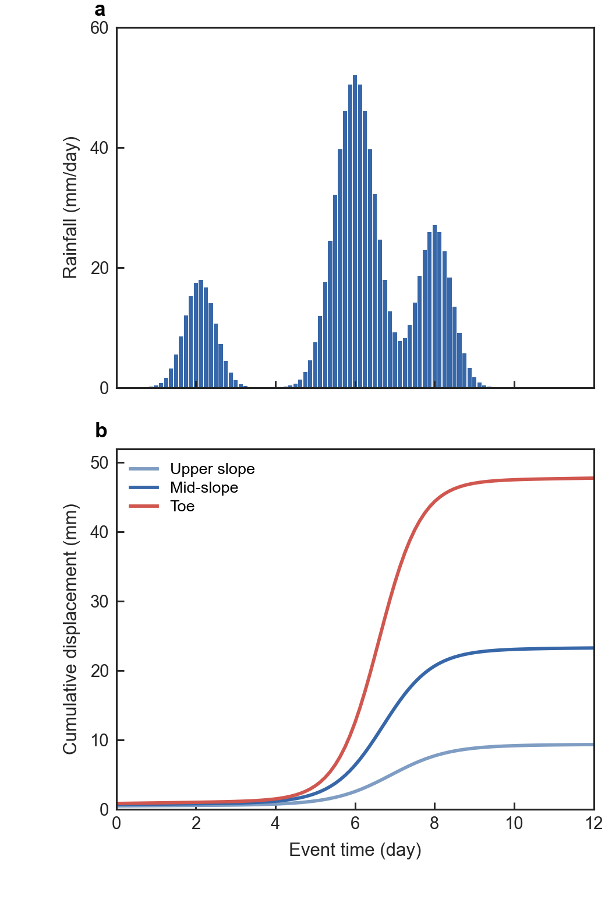
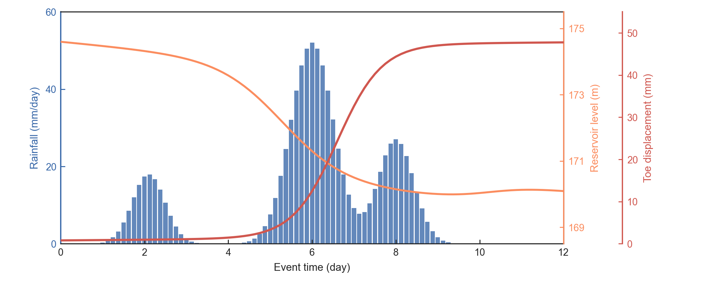
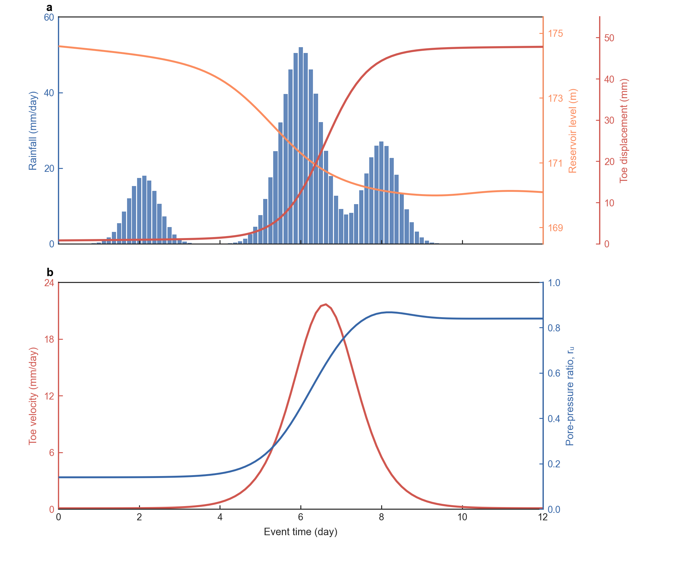

# geology-figure

`geology-figure` is a Codex skill for publication-grade geology, geotechnical, and landslide figures in a calibrated Origin-inspired Python/Matplotlib style.

It standardizes matrix notation, journal widths, typography, boxed axes, colour semantics, legend placement, dual/triple axes, source-data boundaries, alignment checks, and export formats.

## Core conventions

- Layout notation is `rows x columns`: `1 x 2` is horizontal and `2 x 1` is vertical.
- Simple `2 x 1` figures default to 89 mm; horizontal or complex multi-axis figures default to 180 mm.
- Four-sided boxed axes, inward ticks, white backgrounds, and no default grid.
- Blue indicates neutral/baseline states, orange transition, and red the strongest response or hazard.
- Dual and triple y axes are allowed when all variables share one x basis and every axis is colour- and unit-matched.
- Formal figures contain no overall title, palette card, watermark, or decorative banner.

## Included resources

- `SKILL.md`: Skill entrypoint.
- `references/style-contract.md`: reviewed personal visual rules.
- `references/chart-recipes.md`: geology-specific plot selection.
- `references/data-and-qa.md`: data-integrity and QA contract.
- `scripts/geology_style.py`: reusable Matplotlib style, dimensions, alignment audit, multi-axis helpers, and export bundle.
- `scripts/calibration_demo.py`: deterministic installation and style test.

## Installation

Clone the repository into the Codex skills directory so the final path is:

```text
~/.codex/skills/geology-figure/SKILL.md
```

Install plotting dependencies with:

```bash
python -m pip install -r requirements.txt
```

Run the deterministic calibration test with:

```bash
python scripts/calibration_demo.py --output examples/generated
```

The calibration output is illustrative and must not be used as scientific evidence.

## Preview

### `2 x 1` vertical single-column layout



### Three-y-axis layout



### Complex vertical multi-axis layout


